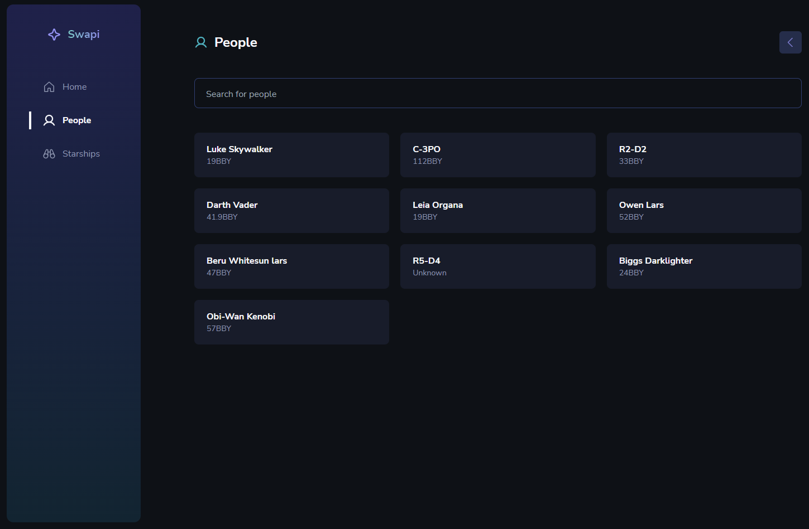

# Swapi

## Overview

### App
Check it out now and test the app: [Swapi](https://swapi-omega.vercel.app/people).

### Screenshot

### Built with

- React
- TypeScript
- Tailwind

### What I learned

This challenge was a good way for me to start my learning and applications of Tailwind CSS and API consume.

## Author

- Linkedin - [Thullyo Damasceno](https://www.linkedin.com/in/thullyo-damasceno-375083231)
